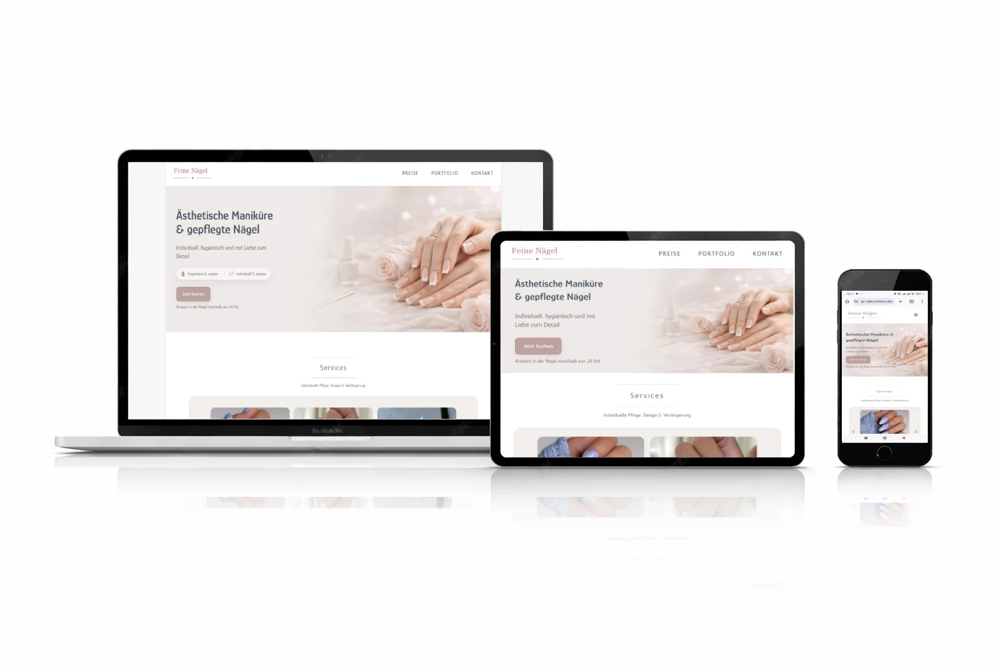

## Live Demo
👉 https://wp-nails.reitarov.dev

# Nail Salon – Custom WordPress Theme

Custom WordPress theme developed from scratch for a nail salon website.  
No page builders, no ready-made themes — clean PHP, custom layout, and flexible content management.

## Features
- Custom WordPress theme (from scratch)
- Fully responsive 
- Advanced Custom Fields (ACF) for content management
- Custom services slider
- Image gallery (masonry-style)
- Testimonials section
- Modal booking / contact form
- Smooth scrolling and subtle animations

## Tech Stack
- WordPress
- PHP
- HTML5
- CSS3
- JavaScript (Vanilla)
- ACF

## Notes
This project was created as a portfolio project to demonstrate custom WordPress theme development.
